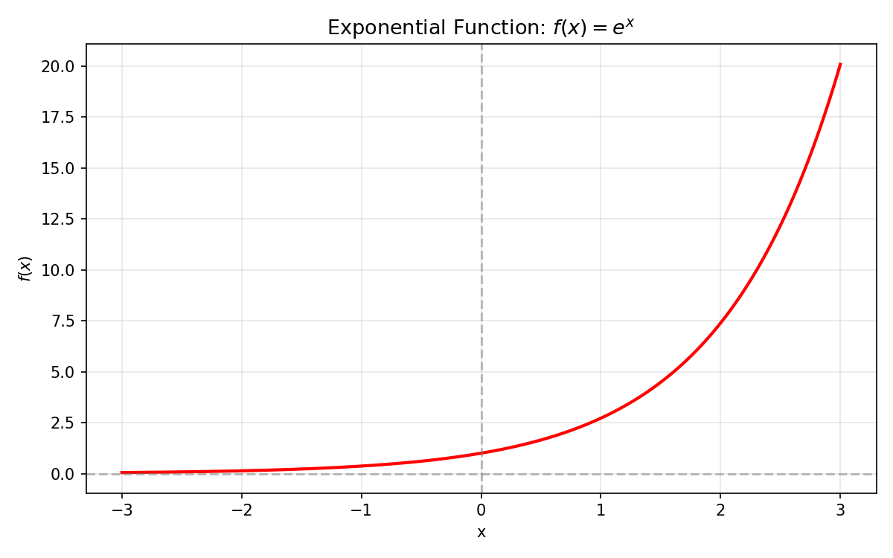
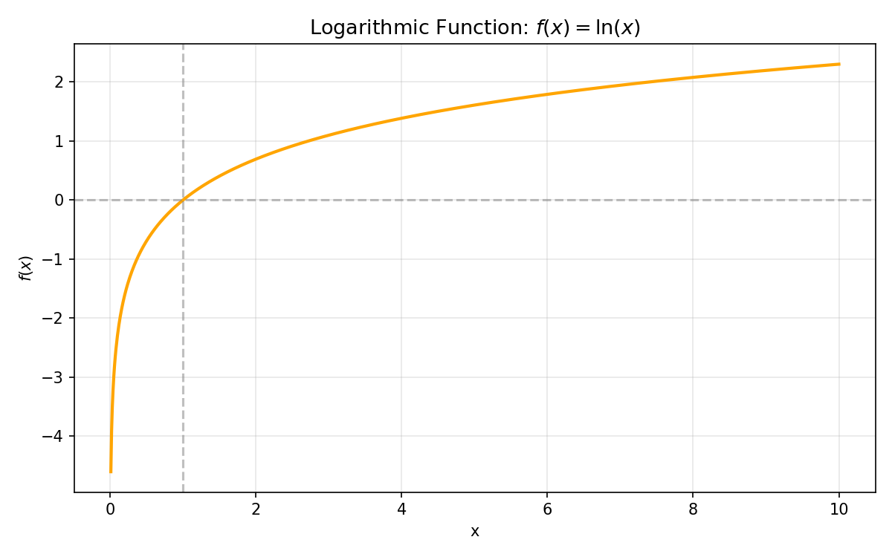

# 附录 · 数学基础

学习机器学习的理论需要一些数学基础。本附录涵盖了理解本书核心算法所需的数学知识，作为快速参考。如果你已经熟悉这些内容，可以直接跳过；如果觉得生疏，建议花时间复习。

## A.1 求和符号 $\Sigma$ 与求积符号 $\Pi$

### 求和符号 $\Sigma$（Sigma）

求和符号用来表示多个数的累加：

$$\sum_{i=1}^{n} a_i = a_1 + a_2 + a_3 + \dots + a_n$$

- $\Sigma$ 下方 $i=1$ 表示起始索引
- $\Sigma$ 上方 $n$ 表示结束索引
- 索引 $i$ 依次从 1 取到 $n$，将对应的 $a_i$ 全部加起来

**示例**：

$$\sum_{i=1}^{5} i^2 = 1^2 + 2^2 + 3^2 + 4^2 + 5^2 = 55$$

### 求积符号 $\Pi$（Pi）

求积符号用来表示多个数的连乘：

$$\prod_{i=1}^{n} a_i = a_1 \times a_2 \times a_3 \times \dots \times a_n$$

**示例**：

$$\prod_{i=1}^{5} i = 1 \times 2 \times 3 \times 4 \times 5 = 120$$

在机器学习中，$\Pi$ 符号常用于联合概率和似然函数的表示。

## A.2 微分

### 基本概念

**导数**描述函数在某一点的变化率。对于函数 $f(x)$，其在 $x=a$ 处的导数 $f'(a)$ 表示函数在 $a$ 点附近的斜率——$x$ 变化一个极小量时，$f(x)$ 的变化量。

**几何意义**：导数等于函数曲线在该点处切线的斜率。

### 常用导数公式

| 函数 $f(x)$ | 导数 $f'(x)$ | 说明 |
|-----------|-----------|------|
| $c$（常数） | $0$ | 常量函数不变 |
| $x$ | $1$ | 斜率为 1 |
| $x^2$ | $2x$ | |
| $x^n$ | $n \cdot x^{n-1}$ | 通用幂函数法则 |
| $e^x$ | $e^x$ | 自然指数函数的导数是自身 |
| $\log x$ | $1/x$ | 对数函数的导数 |
| $\sin x$ | $\cos x$ | |
| $\cos x$ | $-\sin x$ | |

### 导数的线性性质

- 和的导数 = 导数的和：$(f(x) + g(x))' = f'(x) + g'(x)$
- 常数倍的导数 = 常数倍导数：$(c \cdot f(x))' = c \cdot f'(x)$

这意味着我们可以把复杂的函数拆分成简单函数的和，然后分别求导再相加。

### 导数与极值

- $f'(a) = 0$ 且 $f''(a) > 0$ → $x = a$ 是局部极小值点
- $f'(a) = 0$ 且 $f''(a) < 0$ → $x = a$ 是局部极大值点

这是梯度下降法找到最小值（或梯度上升法找到最大值）的理论基础。

## A.3 偏微分

### 多变量函数的微分

当函数 $f$ 依赖多个变量（如 $f(x_1, x_2, x_3)$）时，对一个变量求导而将其他变量视为常数，称为**偏微分**。记作 $\frac{\partial f}{\partial x_1}$ 或 $f_{x_1}$。

**直观理解**：偏微分回答"固定其他变量不变，只改变这一个变量，函数值变化多快"。

### 偏微分计算

对 $f(x_1, x_2) = 3x_1^2 + 2x_1 \cdot x_2 + x_2^2$：

- $\frac{\partial f}{\partial x_1} = 6x_1 + 2x_2$（只对 $x_1$ 求导，$x_2$ 视为常数）
- $\frac{\partial f}{\partial x_2} = 2x_1 + 2x_2$（只对 $x_2$ 求导，$x_1$ 视为常数）

### 梯度向量

所有偏导数组成的向量就是**梯度**：

$$\nabla f = \left[ \frac{\partial f}{\partial x_1},\ \frac{\partial f}{\partial x_2},\ \dots,\ \frac{\partial f}{\partial x_n} \right]^T$$

梯度指向函数值**上升最快**的方向。在梯度下降中，我们沿着梯度的**反方向**走，以达到函数值最小化的目的。

## A.4 复合函数的微分（链式法则）

### 链式法则

如果 $y = f(u)$，$u = g(x)$，则：

$$\frac{dy}{dx} = \frac{dy}{du} \cdot \frac{du}{dx}$$

**直观理解**：$x$ 的变化引起 $u$ 的变化，$u$ 的变化又引起 $y$ 的变化，总变化率 = 两个变化率的乘积。

### 多步复合

如果 $y = f(u)$，$u = g(v)$，$v = h(x)$，则：

$$\frac{dy}{dx} = \frac{dy}{du} \cdot \frac{du}{dv} \cdot \frac{dv}{dx}$$

链式法则可以无限扩展，这正是神经网络反向传播算法的数学基础。

### 在机器学习中的应用

链式法则在机器学习中无处不在。例如，计算平方误差目标函数 $E = \frac{1}{2}(\theta^T x - y)^2$ 对 $\theta$ 的导数：

设 $u = E$，$v = \theta^T x - y$，则：
- $\frac{\partial E}{\partial v} = v = \theta^T x - y$
- $\frac{\partial v}{\partial \theta_j} = x_j$
- $\frac{\partial E}{\partial \theta_j} = \frac{\partial E}{\partial v} \cdot \frac{\partial v}{\partial \theta_j} = (\theta^T x - y) \cdot x_j$

## A.5 向量与矩阵

### 向量

向量是一组有序的数，可以用列向量的形式表示：

$$
x = \begin{bmatrix} x_1 \\ x_2 \\ \vdots \\ x_n \end{bmatrix}
$$

向量可以看作空间中的一个点，或者是原点指向该点的箭头（有大小和方向）。

### 向量内积（点积）

两个同维度向量对应元素相乘再相加：

$$u \cdot v = \sum_i u_i \cdot v_i = u_1 v_1 + u_2 v_2 + \dots + u_n v_n$$

内积在机器学习中应用极广，它等价于线性模型的表达式 $\theta_0 \cdot x_0 + \theta_1 \cdot x_1 + \dots + \theta_n \cdot x_n$。

### 转置

将一个向量（或矩阵）的行和列互换：

$$\theta = [\theta_0,\ \theta_1,\ \dots,\ \theta_n]^T \quad \text{（列向量）}$$

$$\theta^T = [\theta_0,\ \theta_1,\ \dots,\ \theta_n] \quad \text{（行向量）}$$

用转置可以简洁地表示内积：$\theta^T \cdot x$。

### 向量的长度（模/范数）

$$|x| = \sqrt{x_1^2 + x_2^2 + \dots + x_n^2}$$

### 矩阵

矩阵是二维的数组，有 $m$ 行 $n$ 列。在机器学习中，训练数据通常组织成矩阵形式：每行是一个样本，每列是一个特征。

## A.6 几何向量

### 向量的几何表示

向量可以用坐标系中带箭头的线段表示：
- 起点：原点
- 终点：向量元素的值确定的坐标
- 长度：向量的模
- 方向：箭头所指的方向

### 内积的几何含义

$$u \cdot v = |u| \cdot |v| \cdot \cos\theta$$

其中 $\theta$ 是 $u$ 和 $v$ 之间的夹角。

这个公式揭示了内积的深层含义：
- 内积为正 ($\cos\theta > 0$) → 两个向量的方向相近（$\theta < 90^\circ$）
- 内积为零 ($\cos\theta = 0$) → 两个向量垂直（$\theta = 90^\circ$ 或 $270^\circ$）
- 内积为负 ($\cos\theta < 0$) → 两个向量的方向相反（$\theta > 90^\circ$）

在分类问题中，$w \cdot x = 0$ 定义了决策边界——所有与权重向量 $w$ 垂直的向量集合。

### 法向量

法向量是垂直于某条直线（或平面、超平面）的向量。

对于直线 $w \cdot x = 0$，权重向量 $w$ 恰好是这条直线的法向量。因此，改变 $w$ 的方向就改变了决策边界的方向，改变 $w$ 的长度不影响决策边界的位置（因为 $w \cdot x = 0$ 两边可以同时除以 $|w|$）。

## A.7 指数与对数

### 指数函数

$$\exp(x) = e^x$$

其中 $e \approx 2.71828\ldots$ 是自然常数（欧拉数）。

**指数函数的性质**：
- $\exp(0) = 1$
- $\exp(x) > 0$ 恒成立（永远为正）
- $\exp(-x) = 1 / \exp(x)$
- $\frac{d}{dx} \exp(x) = \exp(x)$（导数是自身，唯一的函数！）

*指数函数 $e^x$ — 单调递增，始终为正，穿过 $(0,1)$*

在机器学习中，指数函数主要用于 sigmoid 函数和 softmax 函数。

### 对数函数

对数是指数的逆运算：$\log(\exp(x)) = x$。

通常 $\log$ 指**自然对数**（以 $e$ 为底），记作 $\ln$ 或 $\log$。

**对数函数的性质**：
- $\log(1) = 0$
- $\log(e) = 1$
- $\log(a \cdot b) = \log a + \log b$（非常重要！乘积变加法）
- $\log(a / b) = \log a - \log b$
- $\log(a^b) = b \cdot \log a$（指数变系数）
- $\frac{d}{dx} \log x = 1 / x$

*自然对数 $\ln(x)$ — 单调递增，在 $x<1$ 时为负，穿过 $(1,0)$*

**单调递增性**：如果 $x_1 < x_2$，必有 $\log(x_1) < \log(x_2)$。这意味着最大化一个函数等价于最大化它的对数——这是在似然函数中取对数的理论依据。

## A.8 机器学习中数学的运用总结

| 数学工具 | 在 ML 中的应用 |
|----------|---------------|
| $\Sigma$ 求和 | 目标函数中累加所有样本的误差 |
| $\Pi$ 求积 | 似然函数中计算联合概率 |
| 微分 | 计算目标函数的梯度 |
| 偏微分 | 对多个参数分别求导 |
| 链式法则 | 复合目标函数的求导 |
| 向量内积 | 线性模型的简洁表示 |
| 梯度 | 确定参数更新的方向 |
| 指数 $\exp$ | sigmoid 函数的核心组件 |
| 对数 $\log$ | 将对数似然函数变形为求和形式 |

这些数学工具看似基础，但组合起来就能构建出强大的机器学习模型。理解了它们的含义和用法，你就有能力读懂更多复杂的 ML 论文和实现。

---

> 数学是机器学习的语言。不需要成为数学家，但掌握这些基础，足以让你自信地走进机器学习的殿堂。