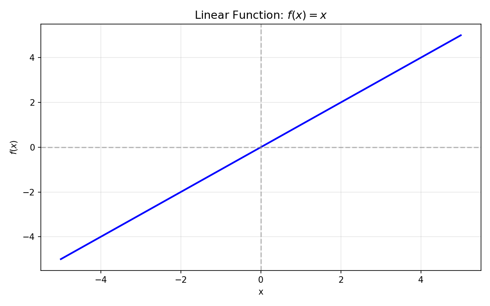
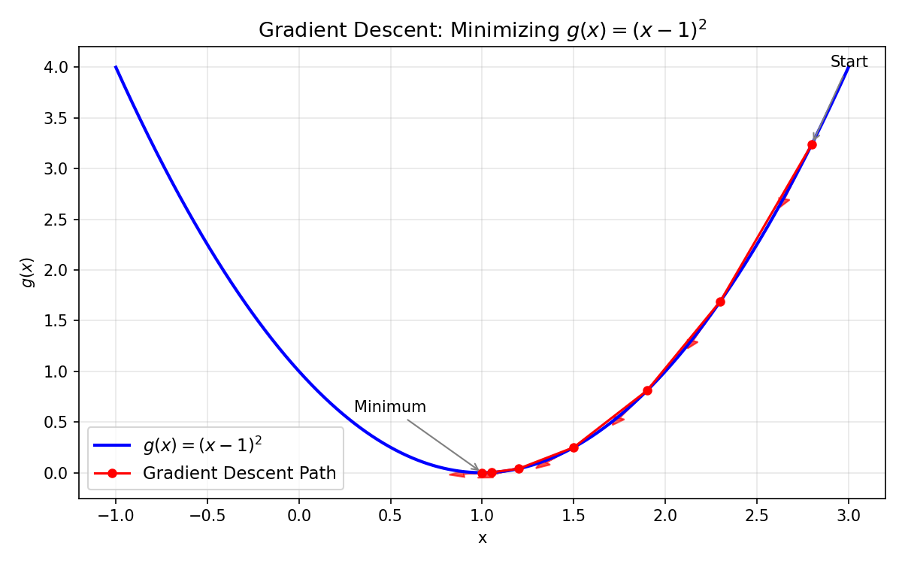
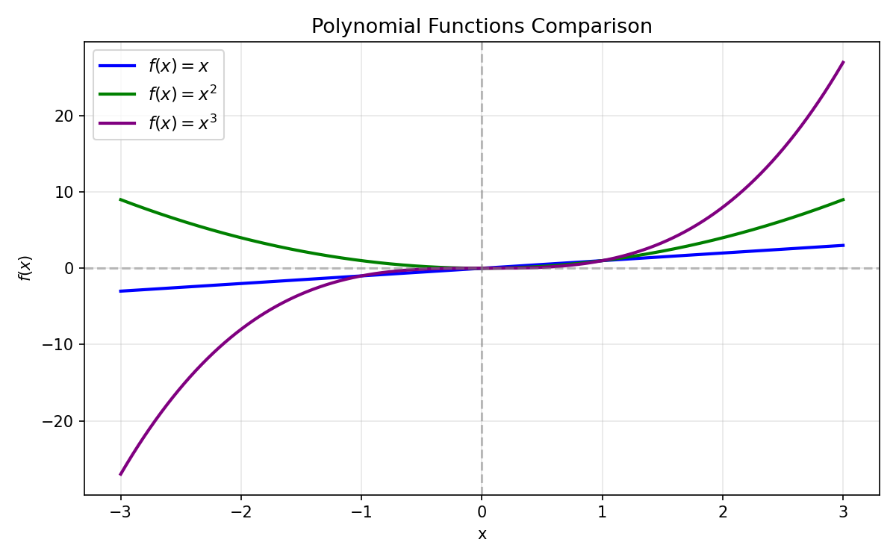

# 第2章 · 学习回归

回归（Regression）是机器学习中最基础的问题类型。它的目标是预测一个**连续的数值**。本章从最简单的一元线性回归开始，逐步深入到多项式回归、多重回归，最后介绍随机梯度下降法这个更高效的优化算法。

## 2.1 问题设定：从广告费预测点击量

我们先从一个具体的例子开始。假设你运营一个网站，在某个广告平台上投入广告费来吸引用户点击。你手上有一些历史数据：

| 广告费（元） | 点击量（次） |
|------------|------------|
| 100 | 200 |
| 200 | 400 |
| 300 | 560 |
| 400 | 720 |
| ... | ... |

你的目标是：**训练出一个函数，对于任意给定的广告费 $x$，能够预测出点击量 $y$**。

把这个目标用数学语言表达：我们要找到一个函数 $f(x)$，使得 $f(\text{广告费}) \approx \text{实际点击量}$。

但世上不存在完美的函数，总会有一些误差。所以机器学习的目标更准确地说，是**让总体误差尽可能小**。

## 2.2 一次函数：最简单的模型

作为起点，我们假设点击量和广告费之间的关系可以用一条直线来描述——最简单的模型就是**一次函数**（线性函数）：

```
f(x) = theta_0 + theta_1 * x
```

其中：
- $\theta_0$ 是**截距**（直线与 y 轴的交点）
- $\theta_1$ 是**斜率**（每增加 1 元广告费，点击量增加多少）
- $\theta_0$ 和 $\theta_1$ 统称为**参数**，它们是需要从数据中学习的未知量

不同的 $\theta_0$ 和 $\theta_1$ 会产生不同的直线。我们的任务是找出那对最优的 $(\theta_0, \theta_1)$。



*一次函数 $f(x) = x$ — 最简单的线性模型，截距为 0、斜率为 1*

## 2.3 目标函数：如何衡量"好"

判断哪条直线更好，需要一个量化的标准。最自然的想法是看**误差**——预测值 $f(x^{(i)})$ 与真实值 $y^{(i)}$ 的差距。

### 平方误差

为什么用"平方"而不用"绝对值"？因为绝对值函数的导数在零点处不存在，不方便后续的求导优化。而平方函数的导数是连续的，数学上更容易处理。

将每个数据点的误差平方后全部加起来，就得到了**平方和误差**：

$$E(\theta) = \sum_i [f(x^{(i)}) - y^{(i)}]^2$$

其中 $i$ 表示第 $i$ 个训练数据。

这个 $E(\theta)$ 就是我们绘制的直线相对于所有训练数据的总误差。$E(\theta)$ 越小，直线越贴合数据。

在实际使用中，通常在前面加上 $\frac{1}{2}$：

$$E(\theta) = \frac{1}{2} \cdot \sum_i [f(x^{(i)}) - y^{(i)}]^2$$

这个 $\frac{1}{2}$ 纯粹是为了**求导方便**——对平方求导会出来一个系数 2，加上 $\frac{1}{2}$ 后正好消掉，让表达式更简洁。它对最小化目标没有影响。

### 为什么叫目标函数

这个 $E(\theta)$ 被称为**目标函数**（Objective Function）或**损失函数**（Loss Function）。它的值取决于参数 $\theta$，我们的任务是找到 $\theta$ 使得 $E(\theta)$ 的值最小。这正是"优化"的含义。

## 2.4 最速下降法：迭代寻找最优参数

### 最小二乘法的局限

既然目标函数 $E(\theta)$ 已经定义好了，最直接的解法是：对 $\theta_0$ 和 $\theta_1$ 分别求偏导数，令它们等于零，然后解方程组。这就是经典的**最小二乘法**。

对于 $\theta_0$ 和 $\theta_1$ 只有两个参数的一元回归，这种方法完全可行。但当参数达到数十、数百甚至数百万个时，解方程组就变得不切实际。

这时候需要一个**迭代的数值方法**——最速下降法（Steepest Descent），也常被称为**梯度下降法**（Gradient Descent）。

### 最速下降法的直观理解

想象你站在一座山的某个位置，眼睛被蒙住了，要走到山谷的最低点。你唯一能感知的信息是你脚下的**坡度**（梯度）。

策略很简单：
1. 感受脚下的坡度，判断哪个方向是下坡
2. 往最陡峭的下坡方向走一小步
3. 重复以上步骤，直到感觉脚下几乎是平的

每一步走多大由**学习率 $\eta$**（读作"eta"）控制。$\eta$ 太小则走得太慢（收敛慢），$\eta$ 太大则可能跳过头（发散）。



*梯度下降迭代过程：从起点出发，每一步沿着梯度反方向移动，逐步逼近最小值点 $(x=1)$*

### 梯度：偏导数的向量

"坡度"在数学上的对应物是**梯度**——由所有偏导数组成的向量。

对于 $E(\theta)$，梯度是：

$$\nabla E(\theta) = \left[ \frac{\partial E}{\partial \theta_0},\ \frac{\partial E}{\partial \theta_1} \right]^T$$

### 推导梯度

将 $f(x) = \theta_0 + \theta_1 \cdot x$ 代入目标函数：

$$E(\theta) = \frac{1}{2} \cdot \sum_i [(\theta_0 + \theta_1 \cdot x^{(i)}) - y^{(i)}]^2$$

利用复合函数求导法则：

**对 $\theta_0$ 求偏导**：

$$\frac{\partial E}{\partial \theta_0} = \sum_i [(\theta_0 + \theta_1 \cdot x^{(i)}) - y^{(i)}] \cdot 1 = \sum_i [f(x^{(i)}) - y^{(i)}]$$

**对 $\theta_1$ 求偏导**：

$$\frac{\partial E}{\partial \theta_1} = \sum_i [(\theta_0 + \theta_1 \cdot x^{(i)}) - y^{(i)}] \cdot x^{(i)} = \sum_i [f(x^{(i)}) - y^{(i)}] \cdot x^{(i)}$$

### 参数更新表达式

梯度告诉我们误差上升最快的方向，但我们想要**下降**，所以要沿着梯度的反方向走：

$$\theta_0 := \theta_0 - \eta \cdot \sum_i [f(x^{(i)}) - y^{(i)}]$$

$$\theta_1 := \theta_1 - \eta \cdot \sum_i [f(x^{(i)}) - y^{(i)}] \cdot x^{(i)}$$

其中 $:=$ 表示赋值（更新），$\eta$ 是学习率。

每次更新都使用**全部训练数据**，这也是它被称为"批量梯度下降"的原因。

## 2.5 多项式回归：超越直线

### 为什么要用曲线

现实世界中的数据很少是一条完美的直线。比如点击量可能随着广告费的增加先快速增长、后趋于平缓——呈现出曲线形状。

多项式回归通过在模型中增加高次项来拟合这种非线性关系：

$$f(x) = \theta_0 + \theta_1 x + \theta_2 x^2 + \theta_3 x^3 + \dots$$



*从上到下：一次函数（直线）、二次函数（开口向上抛物线）、三次函数（S 形曲线）*

### 二次函数的例子

对于二次函数 $f(x) = \theta_0 + \theta_1 x + \theta_2 x^2$：

目标函数同样是平方误差：

$$E(\theta) = \frac{1}{2} \cdot \sum_i [f(x^{(i)}) - y^{(i)}]^2$$

偏导数的形式类似：

$$\frac{\partial E}{\partial \theta_0} = \sum_i [f(x^{(i)}) - y^{(i)}]$$

$$\frac{\partial E}{\partial \theta_1} = \sum_i [f(x^{(i)}) - y^{(i)}] \cdot x^{(i)}$$

$$\frac{\partial E}{\partial \theta_2} = \sum_i [f(x^{(i)}) - y^{(i)}] \cdot (x^{(i)})^2$$

注意模式：每个偏导数都是 `误差 × 对应变量` 的总和。

### 高次项的风险：过拟合

次数不是越高越好。给定 $n$ 个数据点，一个 $n-1$ 次多项式可以完美地穿过每一个点（训练误差为 0），但它会极度扭曲，对新数据的预测一塌糊涂。这就是**过拟合**。

选择多项式的次数需要在"对训练数据的拟合程度"和"对新数据的泛化能力"之间取得平衡。第4章会深入讨论这个问题。

## 2.6 多重回归：处理多个输入变量

### 问题拓展

实际场景中，影响点击量的因素通常不止广告费。可能还包括广告版面的尺寸、位置、时间段等。假设我们有 $n$ 个输入特征：

```
输入: x1 = 广告费, x2 = 广告宽度, x3 = 广告位置分数, ...
```

多重回归的模型为：

$$f(x) = \theta_0 + \theta_1 x_1 + \theta_2 x_2 + \dots + \theta_n x_n$$

### 向量表示：简化一切

用向量来统一表达会让公式变得非常简洁。定义：

$$\theta = [\theta_0,\ \theta_1,\ \theta_2,\ \dots,\ \theta_n]^T$$

$$x = [1,\ x_1,\ x_2,\ \dots,\ x_n]^T \quad \text{（注意：} x_0 = 1 \text{）}$$

特别注意，我们人为添加了一个恒为 1 的 $x_0$。这样做的好处是：$\theta_0$ 可以被统一地处理为 $\theta_0 \cdot x_0 = \theta_0 \cdot 1 = \theta_0$，与 $\theta_1 x_1$、$\theta_2 x_2$ 等保持一致的形式。

这样，模型可以简洁地写成：

$$f_\theta(x) = \theta^T \cdot x = \theta_0 \cdot 1 + \theta_1 x_1 + \theta_2 x_2 + \dots + \theta_n x_n$$

这就是**向量内积**（点积）。

### 统一的参数更新公式

在向量表示下，第 $j$ 个参数 $\theta_j$ 的更新公式为：

$$\frac{\partial E}{\partial \theta_j} = \sum_i [f_\theta(x^{(i)}) - y^{(i)}] \cdot x_j^{(i)}$$

所以：

$$\theta_j := \theta_j - \eta \cdot \sum_i [f_\theta(x^{(i)}) - y^{(i)}] \cdot x_j^{(i)}$$

这个公式统一了所有参数（包括 $\theta_0$，因为 $x_0^{(i)} = 1$）的更新规则。在代码中只需一个循环即可更新所有参数。

## 2.7 随机梯度下降法：更快更稳健

### 批量梯度下降的缺点

之前的最速下降法每次更新参数都要遍历**全部训练数据**。当有数百万个数据时，一次更新就需要很长时间。

另外，批量梯度下降从固定的初始点出发，可能**陷入局部最优解**——即碰到了一个局部的最低点，虽然周围都比它高，但并非全局的最低点。

### 随机梯度下降（SGD）的核心思想

随机梯度下降（Stochastic Gradient Descent, SGD）做了一个简单但巧妙的修改：

**每次随机选择一个训练数据，单独用它来更新参数。**

参数更新公式变为（$k$ 是随机选中的数据索引）：

$$\theta_j := \theta_j - \eta \cdot [f_\theta(x^{(k)}) - y^{(k)}] \cdot x_j^{(k)}$$

与批量更新的对比：
- 批量：一个 epoch（遍历一轮全部数据）更新 1 次参数
- SGD：一个 epoch 更新 $n$ 次参数（$n$ 为数据量）

### SGD 的优势

1. **速度快**：批量梯度下降更新 1 次的时间，SGD 可以更新 $n$ 次
2. **不容易陷入局部最优**：因为每次使用不同的随机数据，梯度方向会有随机性，这种"噪声"有助于跳出局部极小值
3. **适合在线学习**：新数据来了可以直接用来更新模型，不需要重新训练

### 小批量梯度下降（Mini-batch SGD）

这是批量梯度下降和 SGD 的折中方案：每次随机选择 $m$ 个数据来更新参数。

$$\theta_j := \theta_j - \eta \cdot \sum_{k \in K} [f_\theta(x^{(k)}) - y^{(k)}] \cdot x_j^{(k)}$$

其中 $K$ 是随机选择的 $m$ 个数据的索引集合。

小批量方法兼具两者的优势：
- 比批量梯度下降快得多
- 比单个 SGD 更稳定（减少了方差）
- 可以利用 GPU 的并行计算优势（同时处理 $m$ 个数据）

$m$ 的常用值是 32、64、128 等 2 的幂次。

### 关于学习率 $\eta$

学习率是 SGD 中最重要的超参数（需要人为设定的参数，而非从数据中学习）。

- $\eta$ 太大 → 参数在最优解附近来回震荡，甚至发散
- $\eta$ 太小 → 收敛太慢，可能永远到不了最优点

实践中可以通过反复尝试找到合适的值，也可以使用学习率衰减策略——初始用大学习率快速逼近，然后逐步减小做精细调整。
