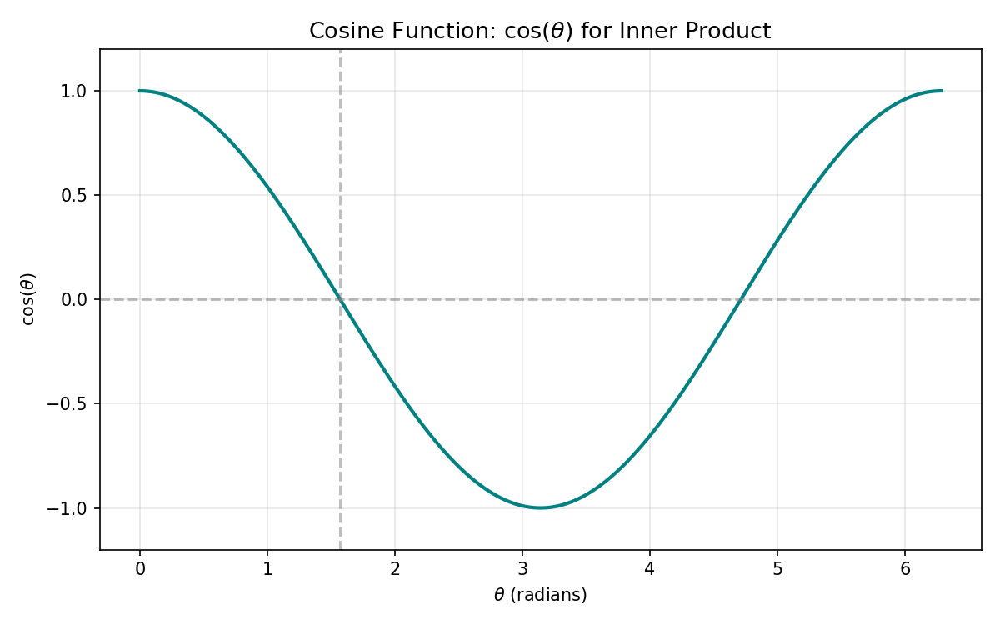
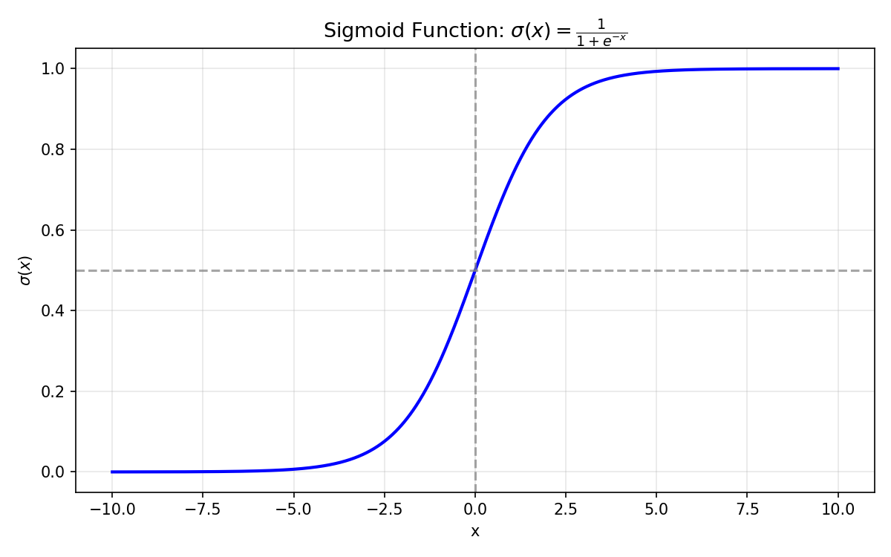
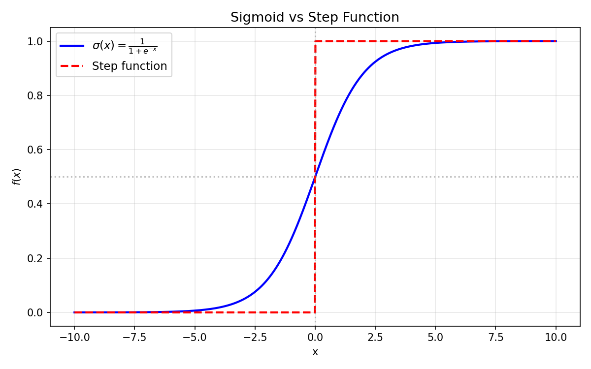

# 第3章 · 学习分类

分类（Classification）是机器学习的三大核心问题之一。与回归预测连续值不同，分类的任务是判断一个样本属于**哪个类别**——输出是离散的有限个值。

本章从最简单的**二分类**问题入手，逐步介绍感知机、逻辑回归等经典算法，并解释如何将这些算法推广到非线性可分的问题。

## 3.1 问题设定：图像方向分类

让我们从一个具体的例子开始。假设我们有一批服装照片，每张照片有宽和高两个属性。我们要根据宽和高判断这张照片是**横向（宽 > 高）**还是**纵向（高 > 宽）**。

收集到的训练数据如下：

| 宽（像素） | 高（像素） | 方向 |
|---------|---------|------|
| 80 | 150 | 纵向 |
| 60 | 110 | 纵向 |
| 35 | 130 | 纵向 |
| 160 | 50 | 横向 |
| 160 | 20 | 横向 |
| 125 | 30 | 横向 |

把数据画在坐标系里（横轴为宽 $x_1$，纵轴为高 $x_2$），横向的点和纵向的点应该分布在不同的区域。分类的目标就是**找到一条分界线，把两类数据分开**。

## 3.2 向量内积与决策边界

### 内积的含义

向量内积（点积）的定义：

$$w \cdot x = w_1 x_1 + w_2 x_2 + \dots + w_n x_n$$

内积在几何上有一个重要的解释：

$$w \cdot x = |w| \cdot |x| \cdot \cos \theta$$

其中 $|w|$ 和 $|x|$ 是向量的长度（模），$\theta$ 是两个向量之间的夹角。

*$\cos(\theta)$ 随角度变化：夹角越小，$\cos$ 越接近 1，内积越大；夹角为 90° 时内积为 0；夹角为 180° 时内积为负极大值*

由于 $|w|$ 和 $|x|$ 总是正数，**内积的符号完全由 $\cos\theta$ 决定**：
- $\cos\theta > 0$ 时（$0^\circ < \theta < 90^\circ$ 或 $270^\circ < \theta < 360^\circ$），内积为正
- $\cos\theta = 0$ 时（$\theta = 90^\circ$ 或 $270^\circ$），内积为零
- $\cos\theta < 0$ 时（$90^\circ < \theta < 270^\circ$），内积为负

### 决策边界的表达式

分类模型的核心是用一条直线（在高维空间中是超平面）把空间分成两半。这条直线可以用**权重向量 $w$** 来表达：

$$w \cdot x = 0$$

这条直线有一个重要的几何性质：**权重向量 $w$ 是这条直线的法向量**（垂直于直线）。

以二维为例，设 $w = (1, 1)$，则内积表达式为：

$$w \cdot x = 1 \cdot x_1 + 1 \cdot x_2 = 0 \quad \rightarrow \quad x_2 = -x_1$$

这是一条斜率为 $-1$ 的直线，而向量 $w = (1, 1)$ 恰好垂直于这条直线。

**决策边界**就是这条直线：边界的一侧点满足 $w \cdot x \ge 0$，另一侧满足 $w \cdot x < 0$。

## 3.3 感知机：最简单的分类模型

### 感知机模型

感知机（Perceptron）是最古老的机器学习模型之一，由 Frank Rosenblatt 在 1957 年提出。它的判别函数为：

$$f_w(x) = \begin{cases} +1, & w \cdot x \ge 0 \\ -1, & w \cdot x < 0 \end{cases}$$

其中 $y = +1$ 表示正类（横向），$y = -1$ 表示负类（纵向）。

感知机可以理解为：计算输入向量与权重向量的内积，根据内积的符号决定分类结果。

### 感知机的几何解释

- 当 $w \cdot x \ge 0$ 时，$x$ 与 $w$ 的夹角在 $[-90^\circ, 90^\circ]$ 范围内，$x$ 被分类为正类
- 当 $w \cdot x < 0$ 时，$x$ 与 $w$ 的夹角在 $(90^\circ, 270^\circ)$ 范围内，$x$ 被分类为负类

### 感知机的参数更新规则

感知机只在**分类错误**时才更新参数。更新规则非常直观：

$$w := w + y^{(i)} \cdot x^{(i)}$$

其中 $y^{(i)} \in \{+1, -1\}$ 是第 $i$ 个训练数据的真实标签。

**直观理解**：
- 如果真实标签是 $+1$（正类），但模型预测为 $-1$（内积为负），说明 $w$ 的方向与 $x$ 偏差太大。更新 $w := w + x$，让 $w$ 向 $x$ 的方向旋转，下次就更可能把 $x$ 分类为正类。
- 如果真实标签是 $-1$（负类），但模型预测为 $+1$（内积为正），说明 $w$ 的方向太接近 $x$ 了。更新 $w := w - x$，让 $w$ 远离 $x$ 的方向旋转。

### 感知机的局限：线性可分

感知机最大的局限是**只能处理线性可分的问题**。

**线性可分**指的是：能用一条直线（或高维空间中的超平面）把两类数据完全分开。

如果数据不是线性可分的（比如两个类别的数据交织在一起，无法用直线分开），感知机**无法收敛**——参数会一直更新下去，永远找不到一条能把所有数据正确分类的直线。

现实中大多数问题都不是线性可分的。比如手写数字识别、图像分类等问题，特征空间的结构非常复杂，简单的直线完全无法胜任。

尽管如此，感知机仍然是理解神经网络的基础——现代神经网络中的"神经元"本质上就是一个广义的感知机。

## 3.4 逻辑回归：用概率来分类

逻辑回归（Logistic Regression）克服了感知机的局限，它是机器学习中最常用的分类算法之一。

### 思路转变：从硬分类到概率

感知机的输出是**硬分类**（$+1$ 或 $-1$），逻辑回归的输出是**概率**——样本属于正类的概率 $P(y=1 \mid x)$。

将问题重新设定：
- $y = 1$ 表示正类（比如横向图像）
- $y = 0$ 表示负类（比如纵向图像）

逻辑回归模型给出的是 $P(y=1 \mid x)$，即给定输入 $x$ 时，样本属于正类的概率。

### Sigmoid 函数

如何将线性组合 $\theta^T x$ 映射到 $(0, 1)$ 区间的概率值？答案是使用 **sigmoid 函数**：

$$\sigma(z) = \frac{1}{1 + \exp(-z)}$$

在逻辑回归中：

$$f_\theta(x) = \sigma(\theta^T x) = \frac{1}{1 + \exp(-\theta^T x)}$$

**Sigmoid 函数的两个关键性质**：
1. 当 $\theta^T x = 0$ 时，$f_\theta(x) = 0.5$
2. $0 < f_\theta(x) < 1$ 恒成立，因此可以解释为概率

Sigmoid 函数的图像呈 S 形，在 $z = 0$ 附近变化剧烈，在 $|z|$ 很大时趋于饱和（接近 0 或 1）。

*Sigmoid 函数 $\sigma(z) = \frac{1}{1+e^{-z}}$ — S 形曲线，值域在 $(0,1)$*

与阶跃函数（硬分类，0 或 1）不同，sigmoid 提供了平滑的概率输出：

*实线：sigmoid（平滑过渡），虚线：阶跃函数（硬切换）*

### 决策边界

有了概率输出后，我们需要一个阈值来做最终的分类决策。最常用的是 0.5：

$$y = \begin{cases} 1, & f_\theta(x) \ge 0.5 \\ 0, & f_\theta(x) < 0.5 \end{cases}$$

注意 $f_\theta(x) \ge 0.5$ 等价于 $\theta^T x \ge 0$，$f_\theta(x) < 0.5$ 等价于 $\theta^T x < 0$。

因此，**决策边界仍然是 $\theta^T x = 0$ 这条直线**！逻辑回归和感知机的决策边界在形式上是一致的，区别在于：
- 感知机直接输出分类结果
- 逻辑回归先输出概率，再根据阈值做分类

### 处理线性不可分问题

逻辑回归的线性版本（$\theta^T x$ 是 $x$ 的线性组合）仍然只能处理线性可分问题。但我们可以通过**增加高次特征**来突破这个限制。

例如，在 $x$ 中加入 $x_1^2$（$x_1$ 的平方），则：

$$\theta^T x = \theta_0 + \theta_1 x_1 + \theta_2 x_2 + \theta_3 x_1^2$$

令 $\theta^T x = 0$，得到：

$$x_2 = -(\theta_0 + \theta_1 x_1 + \theta_3 x_1^2) / \theta_2$$

这是一条**二次曲线**！通过增加高次项，决策边界可以从直线变成曲线，从而处理线性不可分的问题。

在实践中，我们经常会加入各种组合特征（$x_1^2, x_2^2, x_1 x_2$ 等），让模型有能力拟合更复杂的决策边界。

## 3.5 似然函数：逻辑回归的目标函数

### 从误差到似然

回归问题用**误差的平方**作为目标函数，逻辑回归则使用**似然（Likelihood）**作为目标函数。

**似然的含义**：在给定参数 $\theta$ 的情况下，当前训练数据出现的概率。我们希望找到让这个概率最大的参数 $\theta$。

对于每个训练样本 $(x^{(i)}, y^{(i)})$：
- 如果 $y^{(i)} = 1$，我们希望 $P(y=1 \mid x^{(i)})$ 尽可能大
- 如果 $y^{(i)} = 0$，我们希望 $P(y=0 \mid x^{(i)})$ 尽可能大

由于各个训练数据是相互独立的，整个训练数据集的联合概率就是每个样本概率的乘积：

$$L(\theta) = \prod_i [f_\theta(x^{(i)})]^{y^{(i)}} \cdot [1 - f_\theta(x^{(i)})]^{1 - y^{(i)}}$$

这个表达式利用了 $y \in \{0,1\}$ 的性质：当 $y=1$ 时，$[1-f_\theta(x)]^{1-1} = [1-f_\theta(x)]^0 = 1$，只剩下 $[f_\theta(x)]^1$；当 $y=0$ 时，$[f_\theta(x)]^0 = 1$，只剩下 $[1-f_\theta(x)]^1$。

### 对数似然

直接对 $L(\theta)$ 求导很困难，因为：
1. 连乘会导致数值下溢（概率值很小，乘很多次后就接近零）
2. 乘积的导数比和的导数复杂

解决方法是对似然函数取对数（**对数似然**）：

$$\log L(\theta) = \sum_i \big[ y^{(i)} \log f_\theta(x^{(i)}) + (1-y^{(i)}) \log(1 - f_\theta(x^{(i)})) \big]$$

取对数的依据：
- $\log$ 是**单调递增函数**，最大化 $L(\theta)$ 等价于最大化 $\log L(\theta)$
- $\log(a \cdot b) = \log a + \log b$：把乘积变成求和
- $\log(a^b) = b \cdot \log a$：把指数变成系数

### 参数更新公式

对对数似然函数求偏导（利用 sigmoid 函数的导数性质 $\frac{d\sigma(z)}{dz} = \sigma(z)(1-\sigma(z))$），最终得到参数更新公式：

$$\theta_j := \theta_j + \eta \cdot \sum_i [y^{(i)} - f_\theta(x^{(i)})] \cdot x_j^{(i)}$$

注意这里是**加号**而不是减号，因为我们在**最大化**对数似然函数（而回归中是最小化误差函数）。

为了和回归的更新公式保持形式一致，可以把表达式改写为：

$$\theta_j := \theta_j - \eta \cdot \sum_i [f_\theta(x^{(i)}) - y^{(i)}] \cdot x_j^{(i)}$$

这和回归问题的参数更新公式**形式完全一样**！唯一的不同是 $f_\theta(x)$ 的定义：回归中是线性函数，逻辑回归中是 sigmoid 函数。

## 3.6 感知机 vs 逻辑回归

| 特性 | 感知机 | 逻辑回归 |
|------|--------|----------|
| 输出 | 硬分类（$+1/-1$） | 概率（$0 \sim 1$） |
| 决策边界 | $\theta^T x = 0$ | $\theta^T x = 0$ |
| 目标函数 | 分类错误次数 | 对数似然 |
| 线性可分 | 只能处理线性可分 | 可处理（通过高次特征） |
| 收敛性 | 线性可分时收敛 | 总是收敛 |